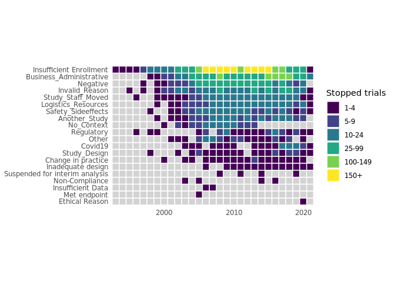
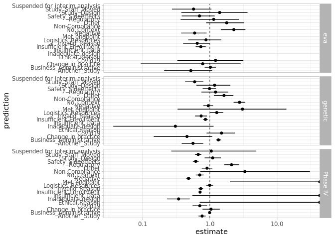

Study stop reasons
================
10 September, 2021

-   [Clinical trial stop reason
    interpretation](#clinical-trial-stop-reason-interpretation)
    -   [Sentence similarities](#sentence-similarities)
    -   [Data prep](#data-prep)
    -   [???](#section)
    -   [Specific questions about
        enrollment](#specific-questions-about-enrollment)
    -   [Safety-relevant targets](#safety-relevant-targets)

# Clinical trial stop reason interpretation

## Sentence similarities

``` r
# reading vectors
dd <- read.table(file = "../data/wvectors.csv",
                 sep = ",",
                 header = TRUE,
                 row.names = 1)
rows <- row.names(dd) %>%
    str_replace("^_", "") %>%
    str_replace(":\\s\\d+", "") %>%
    str_replace(" ", "_")
colnames(dd) <- rows
row.names(dd) <- rows

# Vector clustering
hc <- hclust(1 - as.dist(dd), method = "ward.D2")
dend <- as.dendrogram(hc)
dend_data <- dendro_data(dend, type = "rectangle")

# Class frequencies
freq <- read_csv(file = "../data/frequencies.csv",
                 col_names = FALSE) %>%
    setNames(c("class", "freq", "category")) %>%
    mutate(class = str_replace(class, "^_", "")) %>%
    mutate(class = str_replace(class, ":\\s\\d+", "")) %>%
    mutate(class = str_replace(class, " ", "_")) %>%
    mutate(class = fct_relevel(class, dend_data$labels$label))
```

    ## Rows: 36 Columns: 3

    ## ── Column specification ─────
    ## Delimiter: ","
    ## chr (2): X1, X3
    ## dbl (1): X2

    ## 
    ## ℹ Use `spec()` to retrieve the full column specification for this data.
    ## ℹ Specify the column types or set `show_col_types = FALSE` to quiet this message.

``` r
# Class frequencies
p_dendro <- ggplot(dend_data$segments) +
    geom_segment(aes(x = x, y = y, xend = xend, yend = yend)) +
    ## geom_text(data = dend_data$labels, aes(x, y, label = label),
    ##           hjust = 0, size = 3)+
    scale_y_reverse() +
    scale_x_continuous(expand = c(0, 0.7)) +
    coord_flip() +
    theme(axis.text = element_blank(),
          axis.ticks = element_blank(),
          axis.title = element_blank(),
          panel.background = element_blank())
p_heatmap <- ggplot(freq) +
    geom_tile(aes(x = "freq", y = class, fill = freq), color = "grey10") +
    geom_text(aes(x = "freq", y = class, label = freq), size = 3) +
    scale_fill_material("blue") +
    scale_x_discrete(expand = c(0, 0)) +
    theme(axis.text = element_blank(),
          axis.ticks = element_blank(),
          axis.title = element_blank(),
          panel.background = element_blank(),
          legend.position = "none")
p_categories <- ggplot(freq) +
    geom_tile(aes(x = "category", y = class, fill = category),
    color = "grey10") +
    scale_fill_nejm() +
    scale_x_discrete(expand = c(0, 0)) +
    theme(axis.text = element_blank(),
          axis.ticks = element_blank(),
          axis.title = element_blank(),
          legend.title = element_text(size = 10),
          legend.text = element_text(size = 9),
          legend.key.size = unit(0.8, "line"),
          panel.background = element_blank())
p_legend_categories <- get_legend(p_categories)
p_labels <- ggplot(freq) +
    geom_point(aes(x = 0, y = class)) +
    scale_x_continuous(expand = c(0, 0)) +
    scale_y_discrete(position = "right") +
    theme(
        axis.text.x = element_blank(),
        axis.text.y = element_text(color = "black"),
        axis.ticks = element_blank(),
        axis.title = element_blank(),
        panel.background = element_blank()
    )
# Compose plot
plot_grid(p_dendro,
          p_heatmap,
          p_categories + theme(legend.position = "none"),
          p_labels,
          p_legend_categories,
          rel_widths = c(2, 0.5, 0.5, 0.75, 1),
          nrow = 1)
```

<!-- -->

## Data prep

``` r
precitions_path <- "gs://ot-team/dochoa/predictions_stop.tsv"
gs_path <- "gs://open-targets-data-releases/"
data_release <- "21.06"
all_evidence_path <- paste(
    gs_path, data_release,
    "/output/etl/parquet/evidence/",
    sep = ""
)
disease_path <- paste(
    gs_path, data_release,
    "/output/etl/parquet/diseases/",
    sep = ""
)
```

**Stop reasons predictions from Olesya**

``` r
## Olesya's predictions for stop reason class
stop_predictions <- spark_read_csv(
    sc,
    path = precitions_path,
    delimiter = "\t",
    header = TRUE,
    memory = FALSE
    ) %>%
    filter(is.na(prediction) != TRUE) %>%
        select("nctid" = "nct_id", prediction) %>%
        sdf_distinct()
```

**Platform clinical data**. All information from ChEMBL: Clinical trial
information + DailyMed + FDA. Includes a few other relevant fields:
study start dates, clinical phase, stop reason.

``` r
clinical <- spark_read_parquet(sc, all_evidence_path, memory = FALSE) %>%
    filter(sourceId == "chembl") %>%
    select(targetId, diseaseId, clinicalStatus,
        clinicalPhase, studyStopReason, urls,
        studyStartDate) %>%
    sdf_unnest(urls) %>%
    mutate(nctid = regexp_extract(url, "(.+)(id=%22)(.+)(%22)", 3)) %>%
    left_join(stop_predictions, by = "nctid") %>%
    mutate(nctid = ifelse(nctid == "", NA, nctid)) %>%
    select(-url)
```

Clinical trial stop reason by year

``` r
stopped_trials <- clinical %>%
    filter(!is.na(prediction)) %>%
    select(
        nctid, studyStartDate, prediction,
        clinicalStatus, clinicalPhase
    ) %>%
    sdf_distinct() %>%
    collect()


stop_to_plot <- stopped_trials %>%
    filter(as.Date(studyStartDate) <= today()) %>%
    mutate(year = year(as.Date(studyStartDate))) %>%
    group_by(year, prediction) %>%
    summarise(count = n(), .groups = "drop") %>%
    complete(year, prediction) %>%
    mutate(
        interval = cut(
            count,
            breaks = c(1, 5, 10, 25, 100, 150, Inf),
            include.lowest = TRUE,
            right = FALSE
        )
    ) %>%
    mutate(interval = fct_recode(interval,
        "1-4" = "[1,5)",
        "5-9" = "[5,10)",
        "10-24" = "[10,25)",
        "25-99" = "[25,100)",
        "100-149" = "[100,150)",
        "150+" = "[150,Inf]"
    ))

stop_to_plot %>%
    ggplot(aes(
        x = year,
        y = fct_reorder(prediction, count, sum, na.rm = TRUE)
    )) +
    geom_tile(aes(fill = interval), color = "white", size = .5) +
    scale_x_continuous(expand = c(0, 0)) +
    scale_fill_manual(
        name = "Stopped trials",
        na.value = "lightgrey",
        values = viridisLite::viridis(length(levels(stop_to_plot$interval))),
        breaks = levels(stop_to_plot$interval)
    ) +
    # scale_fill_viridis_b(na.value = "grey90") +
    coord_fixed() +
    theme_light() +
    theme(
        axis.ticks = element_blank(),
        axis.line = element_blank(),
        panel.border = element_blank(),
        axis.title = element_blank()
    )
```

<!-- -->

``` r
total_by_phase <- clinical %>%
    select(
        nctid, studyStartDate, prediction,
        clinicalStatus, clinicalPhase
    ) %>%
    sdf_distinct() %>%
    collect() %>%
    filter(!is.na(prediction)) %>%
    group_by(clinicalPhase) %>%
    summarise(trialByPhase = n())

stopped_trials %>%
    filter(prediction == "Negative") %>%
    group_by(clinicalPhase) %>%
    summarise(negativeCount = n()) %>%
    inner_join(total_by_phase, by = "clinicalPhase") %>%
    mutate(ratio = negativeCount / trialByPhase)
```

    ## # A tibble: 5 x 4
    ##   clinicalPhase negativeCount
    ##           <dbl>         <int>
    ## 1             0             3
    ## 2             1            83
    ## 3             2           293
    ## 4             3           132
    ## 5             4            36
    ## # … with 2 more variables:
    ## #   trialByPhase <int>,
    ## #   ratio <dbl>

**Genetic evidence data**. Filtering EVA to include only a subset of
meaningful `clinicalSignificances`. The rest of the genetic evidence
remain unfiltered. Scores available.

``` r
## Genetic Evidence: with some minor filters
## clinvar valid significances
clinvar_valids <- c(
    "affects",
    "risk factor",
    "pathogenic",
    "likely pathogenic",
    "protective",
    "drug response"
)
genetic_evd <- spark_read_parquet(sc, all_evidence_path, memory = FALSE) %>%
    filter(datatypeId == "genetic_association") %>%
    ## only subset of clinvar evidence
    sdf_explode("clinicalSignificances", keep_all = TRUE) %>%
    filter((clinicalSignificances %in% clinvar_valids) |
    is.na(clinicalSignificances)) %>%
    select(
        "targetId", "diseaseId", "datasourceId", "score"
    )
```

**Re-computed genetic associations**. Associations recomputed after
removing non-relevant genetic data (from EVA mostly). Ontology expansion
performed.

``` r
## Genetic Associations recomputed:
## applying ontology expansion and showing max score
disease_ancestors <- spark_read_parquet(sc, disease_path, memory = FALSE) %>%
    select("diseaseId" = "id", "propagatedDiseaseId" = "ancestors") %>%
    sdf_explode("propagatedDiseaseId", keep_all = TRUE) %>%
    sdf_bind_rows(
        spark_read_parquet(sc, disease_path) %>%
            select("diseaseId" = "id", "propagatedDiseaseId" = "id")
    )
genetic_ass <- genetic_evd %>%
    left_join(disease_ancestors, by = "diseaseId") %>%
    group_by(targetId, diseaseId, datasourceId) %>%
    summarise(maxScore = max(score, na.rm = TRUE)) %>%
    ungroup()
```

## ???

``` r
comparisons_td <- sdf_bind_rows(
    ## all genetics
    genetic_ass %>%
    select("targetId", "diseaseId") %>%
    mutate(comparison = "genetic"),
    ## genetics by datasource
    genetic_ass %>%
    select("targetId", "diseaseId", "comparison" = "datasourceId"),
    ## T-D in Phase IV+
    clinical %>%
    filter(clinicalPhase == 4) %>%
    select(targetId, diseaseId) %>%
    distinct() %>%
    mutate(comparison = "Phase IV"),
    ## T-D in Phase III+
    clinical %>%
    filter(clinicalPhase >= 3) %>%
    select(targetId, diseaseId) %>%
    distinct() %>%
    mutate(comparison = "Phase III+"),
    ## T-D in Phase II+
    clinical %>%
        filter(clinicalPhase >= 2) %>%
        select(targetId, diseaseId) %>%
        distinct() %>%
        mutate(comparison = "Phase II+")
) %>%
    mutate(comparisonBoolean = TRUE)
```

    ## Warning: ORDER BY is ignored in subqueries without LIMIT
    ## ℹ Do you need to move arrange() later in the pipeline or use window_order() instead?

    ## Warning: ORDER BY is ignored in subqueries without LIMIT
    ## ℹ Do you need to move arrange() later in the pipeline or use window_order() instead?

    ## Warning: ORDER BY is ignored in subqueries without LIMIT
    ## ℹ Do you need to move arrange() later in the pipeline or use window_order() instead?

    ## Warning: ORDER BY is ignored in subqueries without LIMIT
    ## ℹ Do you need to move arrange() later in the pipeline or use window_order() instead?

    ## Warning: ORDER BY is ignored in subqueries without LIMIT
    ## ℹ Do you need to move arrange() later in the pipeline or use window_order() instead?

    ## Warning: ORDER BY is ignored in subqueries without LIMIT
    ## ℹ Do you need to move arrange() later in the pipeline or use window_order() instead?

    ## Warning: ORDER BY is ignored in subqueries without LIMIT
    ## ℹ Do you need to move arrange() later in the pipeline or use window_order() instead?

    ## Warning: ORDER BY is ignored in subqueries without LIMIT
    ## ℹ Do you need to move arrange() later in the pipeline or use window_order() instead?

    ## Warning: ORDER BY is ignored in subqueries without LIMIT
    ## ℹ Do you need to move arrange() later in the pipeline or use window_order() instead?

    ## Warning: ORDER BY is ignored in subqueries without LIMIT
    ## ℹ Do you need to move arrange() later in the pipeline or use window_order() instead?

    ## Warning: ORDER BY is ignored in subqueries without LIMIT
    ## ℹ Do you need to move arrange() later in the pipeline or use window_order() instead?

    ## Warning: ORDER BY is ignored in subqueries without LIMIT
    ## ℹ Do you need to move arrange() later in the pipeline or use window_order() instead?

    ## Warning: ORDER BY is ignored in subqueries without LIMIT
    ## ℹ Do you need to move arrange() later in the pipeline or use window_order() instead?

    ## Warning: ORDER BY is ignored in subqueries without LIMIT
    ## ℹ Do you need to move arrange() later in the pipeline or use window_order() instead?

    ## Warning: ORDER BY is ignored in subqueries without LIMIT
    ## ℹ Do you need to move arrange() later in the pipeline or use window_order() instead?

``` r
# Data frame with all the
longdf <- clinical %>%
    # Defining universe and generate fake ID (target-disease-trial)
    filter(!is.na(nctid)) %>%
    select(targetId, diseaseId, "nctid") %>%
    distinct() %>%
    sdf_with_sequential_id("id") %>%
    # Adding tests for the comparisons
    # 1. Add all potential evidence classes
    full_join(
        comparisons_td %>%
            select("comparison") %>%
            distinct(),
        by = character()
    ) %>%
    # 2. Add all available evidence classes
    left_join(comparisons_td,
        by = c("targetId", "diseaseId", "comparison")
    ) %>%
    na.replace(comparisonBoolean = FALSE) %>%
    # Adding tests for the predictions
    # 1. Add all prediction classes
    full_join(
        clinical %>%
            select(prediction) %>%
            distinct() %>%
            na.omit(),
        by = character()
    ) %>%
    # 2. Add all prediction results
    left_join(
        clinical %>%
            filter(!is.na(nctid) & !is.na(prediction)) %>%
            select("nctid", "prediction") %>%
            distinct() %>%
            mutate(predictionBoolean = TRUE),
        by = c("nctid", "prediction")
    ) %>%
    na.replace(predictionBoolean = FALSE)
```

    ## Warning: ORDER BY is ignored in subqueries without LIMIT
    ## ℹ Do you need to move arrange() later in the pipeline or use window_order() instead?

    ## Warning: ORDER BY is ignored in subqueries without LIMIT
    ## ℹ Do you need to move arrange() later in the pipeline or use window_order() instead?

    ## Warning: ORDER BY is ignored in subqueries without LIMIT
    ## ℹ Do you need to move arrange() later in the pipeline or use window_order() instead?

    ## Warning: ORDER BY is ignored in subqueries without LIMIT
    ## ℹ Do you need to move arrange() later in the pipeline or use window_order() instead?

    ## Warning: ORDER BY is ignored in subqueries without LIMIT
    ## ℹ Do you need to move arrange() later in the pipeline or use window_order() instead?

    ## Warning: ORDER BY is ignored in subqueries without LIMIT
    ## ℹ Do you need to move arrange() later in the pipeline or use window_order() instead?

    ## Warning: ORDER BY is ignored in subqueries without LIMIT
    ## ℹ Do you need to move arrange() later in the pipeline or use window_order() instead?

    ## * Dropped 1 rows with 'na.omit' (21 => 20)

    ## Warning: ORDER BY is ignored in subqueries without LIMIT
    ## ℹ Do you need to move arrange() later in the pipeline or use window_order() instead?

    ## Warning: ORDER BY is ignored in subqueries without LIMIT
    ## ℹ Do you need to move arrange() later in the pipeline or use window_order() instead?

    ## Warning: ORDER BY is ignored in subqueries without LIMIT
    ## ℹ Do you need to move arrange() later in the pipeline or use window_order() instead?

    ## Warning: ORDER BY is ignored in subqueries without LIMIT
    ## ℹ Do you need to move arrange() later in the pipeline or use window_order() instead?

    ## Warning: ORDER BY is ignored in subqueries without LIMIT
    ## ℹ Do you need to move arrange() later in the pipeline or use window_order() instead?

``` r
## Aggregations
trials_by_prediction <- longdf %>%
    filter(predictionBoolean == TRUE) %>%
    group_by(prediction) %>%
    summarise(trialsByPrediction = n_distinct(id))

trials_by_comparison <- longdf %>%
    filter(comparisonBoolean == TRUE) %>%
    group_by(comparison) %>%
    summarise(trialsByComparison = n_distinct(id))

aggregations <- longdf %>%
    group_by(comparison, prediction) %>%
    summarise(
        a = sum(as.numeric(comparisonBoolean & predictionBoolean),
        na.rm = TRUE),
        n = n_distinct(id)
    ) %>%
    ungroup() %>%
    left_join(trials_by_prediction, by = "prediction") %>%
    left_join(trials_by_comparison, by = "comparison") %>%
    mutate(b = trialsByPrediction - a) %>%
    mutate(c = trialsByComparison - a) %>%
    mutate(d = n - b - c + a) %>%
    sdf_persist()
```

``` r
aggregations_r <- aggregations %>%
    collect()

all_tests <- bind_cols(aggregations_r,
    aggregations_r %>%
        rowwise() %>%
        do(broom::tidy(fisher.test(matrix(c(.$a, .$b, .$c, .$d), nrow = 2))))
)
```

``` r
all_tests %>%
    filter(comparison %in% c("genetic", "Phase IV", "eva")) %>%
    filter(a != 0) %>%
    ggplot(aes(x = prediction, y = estimate)) +
    geom_hline(aes(yintercept = 1),
        size = .25,
        linetype = "dashed"
    ) +
    geom_errorbar(aes(ymin = conf.low, ymax = conf.high),
    width = 0) +
    geom_point() +
    scale_y_log10() +
    coord_flip() +
    facet_grid(comparison~.) +
    theme_light()
```

<!-- -->

## Specific questions about enrollment

## Safety-relevant targets
